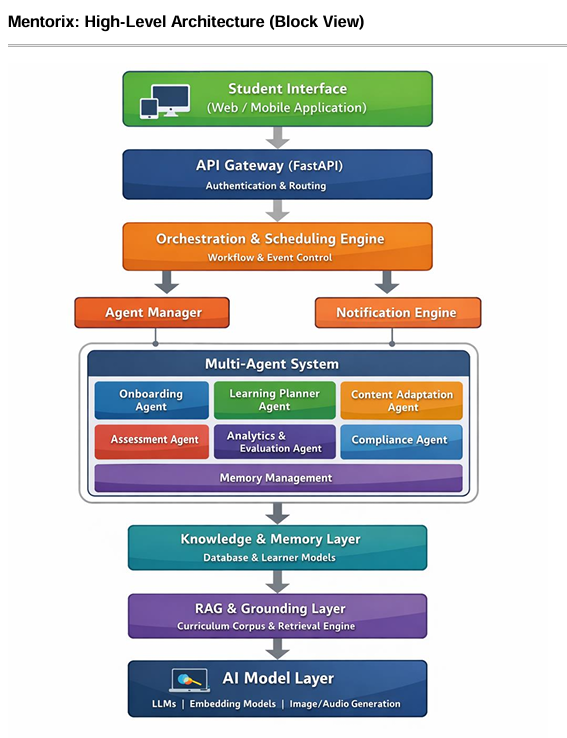

# Mentorix

Autonomous multi-agent personalized learning MVP (CBSE math focus) for capstone evaluation.

## Evaluator Quick Run (3-5 min)

Prerequisite: Docker Desktop/Engine is running.

```powershell
docker compose up --build -d
./scripts/check_ready.ps1
./scripts/test_mvp.ps1
```

Open:
- Frontend: `http://localhost:5500`
- API: `http://localhost:8000`

## What This Demo Proves

- **Autonomy:** session flow runs end-to-end (`start-session -> submit-answer -> dashboard`).
- **Adaptation:** `submit-answer` returns `adaptation_applied` using performance + response time.
- **Grounding:** lesson output stays concept/curriculum focused.
- **Traceability:** evaluator-visible fields (`score`, `error_type`, `weak_areas`).

## Session 19 Additions (Visible in Demo)

- **System 2 reasoning:** content generation runs a bounded Draft-Verify-Refine loop with trace artifacts.
- **Strict model governance:** role-based model routing (`planner`, `optimizer`, `verifier`, `content_generator`) from registry config.
- **Emergency remediation:** verifier fallback path if local verifier is unavailable.
- **Episodic skeleton memory:** run graphs are compressed into recipe-like memory skeletons.
- **Skills 2.0:** both Python skills and Markdown `SKILL.md` skills are supported.
- **JitRL optimizer:** user query optimization with offline rule generation hook.

Quick evaluator endpoints:
- `GET /runs`
- `POST /runs/start`
- `GET /events/stream` (SSE)
- `GET /metrics/fleet`
- `GET /metrics/resilience`
- `GET /memory/hubs`
- `GET /scheduler/jobs`

## Architecture Diagram + Module Map

### Current High-Level Diagram



Reference docs:
- `Mentorix_High_Level_Design.pdf`
- `EAG_V2_Capstone_Idea_Mentorix.pdf`

### Repository Module Map (Current)

- **Runtime App:** `API/app/`
  - `api/` (HTTP endpoints)
  - `agents/` (profiling, planner, content, adaptation, assessment, reflection)
  - `orchestrator/` (state machine and transitions)
  - `rag/` (embedding + retriever pipeline)
  - `memory/` (PostgreSQL/Redis integrations)
  - `models/` (SQLAlchemy entities)
  - `core/` (settings, bootstrap, logging, error envelope)
- **Frontend Demo UI:** `frontend/` (static HTML/CSS/JS)
- **Operational Scripts:** `scripts/` (readiness, smoke, image export/import)
- **Configuration:** `CONFIG/` (`local.env`, templates)
- **Tests:** `tests/` (integration + failure-mode API tests)
- **Research/Design Partitions:** `PERCEPTION/`, `MEMORY/`, `DECISION/`, `ACTION/`, `ORCHESTRATOR/`, `AGENT/`, `MODELS/`, `RAG/`
- **Documentation:** `docs/` (`PLANNER.md`, `DEMO_RUNBOOK.md`)

## API Contract (Core Endpoints)

### `POST /start-session`
Request:
```json
{ "learner_id": "11111111-1111-1111-1111-111111111111" }
```
Response fields:
- `session_id`, `concept`, `difficulty`, `explanation`, `question`, `state`

### `POST /submit-answer`
Request:
```json
{
  "session_id": "26e36f4a-964b-4925-a31a-a1c6fd60df95",
  "answer": "sample answer",
  "response_time": 9.5
}
```
Response fields:
- `score`, `error_type`, `adaptation_applied`, `next_explanation`

### `GET /dashboard/{learner_id}`
Response fields:
- `mastery_map`, `engagement_score`, `weak_areas`, `last_sessions`

### Runtime / Session-19 endpoints
- `POST /runs/start` -> start graph-first autonomous run
- `POST /runs/{run_id}/stop` -> controlled stop
- `GET /runs/{run_id}/graph` -> UI graph payload
- `GET /events/stream` -> live runtime events (SSE)
- `GET /metrics/fleet` -> fleet telemetry
- `GET /metrics/resilience` -> circuit breaker state
- `GET /memory/context/{learner_id}` -> structured memory injection context
- `GET|POST|PATCH|DELETE /scheduler/jobs` -> scheduler CRUD + trigger

## Key References for Review

- Demo flow: `docs/DEMO_RUNBOOK.md`
- Planner/checklist: `docs/PLANNER.md`
- API base: `http://localhost:8000`
- Health: `http://localhost:8000/health`

## Migration Command (if needed)

```powershell
cd API
uv run alembic -c alembic.ini upgrade head
```

## Known Limitations (MVP)

- Seeded curriculum corpus; not full production ingestion.
- Hybrid retrieval is concept-focused (not full cross-document semantic search).
- Heuristic assessment scoring (not exam-grade psychometrics).
- No auth/multi-tenant hardening in MVP.

## V2 (Planned)

- Full curriculum ingestion pipeline + richer chunk metadata.
- Stronger misconception analytics and evaluation engine.
- Auth, RBAC, and audit trail hardening.
- Richer learner analytics and timeline visualization.