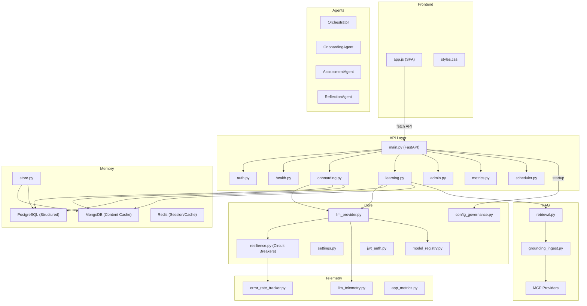
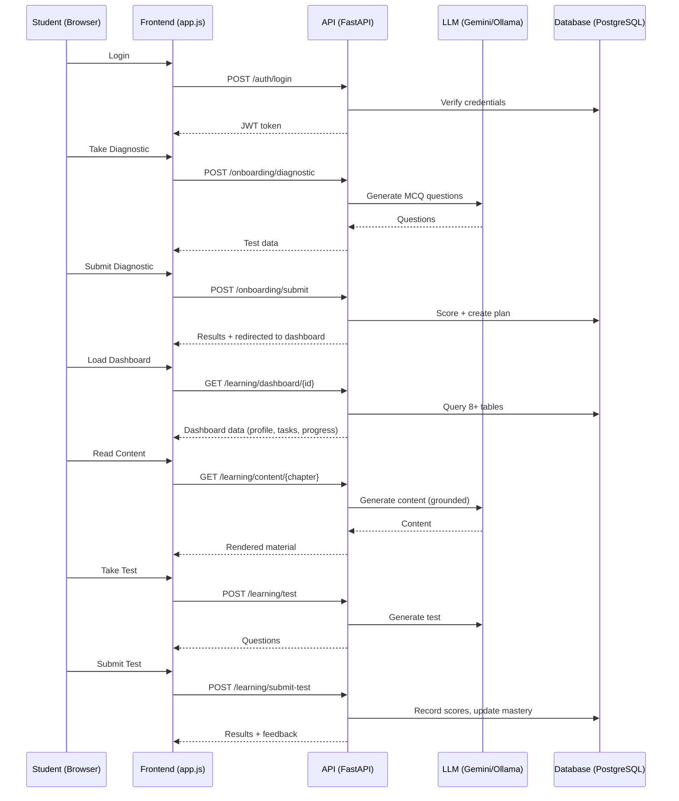

# Mentorix Architecture

## System Overview

## Data Flow: Student Journey

## Module Dependencies

| Module | Depends On | Used By |
|--------|-----------|---------|
| `llm_provider.py` | resilience, model_registry, settings, llm_telemetry, error_rate_tracker | learning.py, onboarding.py |
| `resilience.py` | (standalone) | llm_provider.py, health.py |
| `config_governance.py` | model_registry, settings | main.py (startup) |
| `llm_telemetry.py` | (standalone) | llm_provider.py |
| `error_rate_tracker.py` | (standalone) | llm_provider.py |
| `store.py` | settings, pymongo | health.py, persistence.py |
| `database.py` | settings | all route handlers |
