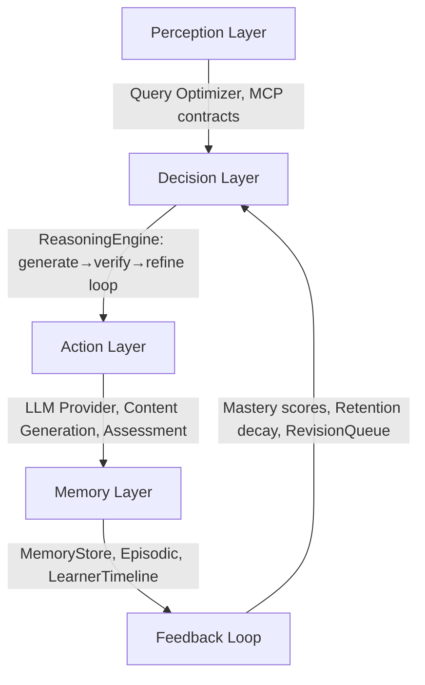

# AI Agent System Technical Audit

## 1. Project Overview

**Mentorix** is an AI-powered adaptive tutoring system for Class 10 CBSE Mathematics. It builds a personalized weekly learning plan for each student, generates grounded curriculum content via LLM, tracks chapter-level mastery, and adapts pacing through a multi-agent architecture.

| Dimension | Detail |
|-----------|--------|
| **Backend** | Python 3.11 / FastAPI, 19 subsystem packages, ~37 MB total codebase |
| **Frontend** | Vanilla JS SPA served via Nginx |
| **Databases** | PostgreSQL (pgvector), MongoDB (memory hubs), Redis (caching + sessions) |
| **Infrastructure** | Docker Compose (5 services), all with healthchecks |
| **LLM Provider** | Google Gemini via REST API with circuit breaker and fallback |
| **Agent Count** | 8 agent classes + graph-based runtime orchestrator |

### Problem Clarity — Score: **8/10**

The problem is well-scoped: personalized math tutoring for a single grade/subject. The architecture directly serves the problem — onboarding diagnostic → weekly plan → chapter read/test loop → mastery tracking → pace adaptation → revision queue. The dual-timeline model (student-selected vs. system-recommended weeks) shows domain awareness.

> [!NOTE]
> The focus on a single subject (Class 10 Math) keeps scope manageable while still exercising all agentic patterns.

---

## 2. Architecture Evaluation

### Modularity — Strong

19 subsystem packages demonstrate intentional separation:

```
agents/          — 14 agent implementations
orchestrator/    — compliance layer + state machine (partially used)
runtime/         — DAG execution engine with graph context
memory/          — Store ABC (File/Mongo/DualWrite), episodic, timeline
core/            — 28 modules: LLM, reasoning, resilience, metrics, auth, config
mcp/             — Model Context Protocol contracts + client
rag/             — grounding ingestion, embeddings, retriever
telemetry/       — LLM telemetry, error rate tracker, aggregator
autonomy/        — scheduler service
models/          — 22 SQLAlchemy entity models
schemas/         — Pydantic request/response schemas
services/        — shared helpers (extracted during refactoring)
```

### Separation of Concerns — Good with Gaps

- ✅ Clean separation between route handlers, schemas, agents, and infrastructure
- ✅ MCP contracts separate communication protocol from implementation
- ✅ Memory store abstracted behind ABC with pluggable backends
- ⚠️ **Critical gap**: Route handlers in `onboarding/routes.py` (2,486 lines) and `learning/routes.py` (3,210 lines) contain the majority of business orchestration logic, while agent classes remain thin stubs

### Architecture Decision:

| Choice | Rationale | Assessment |
|--------|-----------|------------|
| Monolith | Single FastAPI app | ✅ Correct for current scale |
| Dual DB | PostgreSQL for structured, MongoDB for memory | ✅ Good separation; DualWriteMemoryStore enables phased migration |
| pgvector | Embeddings in PostgreSQL | ✅ Eliminates external vector DB dependency |
| Redis | Caching + session state | ✅ Dashboard cache TTL, diagnostic attempt state |
| Nginx frontend | Static SPA serving | ✅ Simple, sufficient |

### Scalability Considerations

- **Vertical**: Single-process FastAPI limits concurrent LLM calls. No async worker pool for content generation.
- **Horizontal**: No shared state beyond DB. Stateless API handlers would scale with load balancer.
- **Database**: Connection pooling configured (`pool_size=10`, `max_overflow=20`). 40+ indexes on 22 tables — well-indexed for read-heavy workloads.

---

## 3. Agentic System Analysis

### Agent Inventory

| Agent | Lines | LLM Integration | Real Logic |
|-------|-------|-----------------|------------|
| `ContentGenerationAgent` | 186 | ✅ Full: adaptive policy, reasoning loop, grounding guardrails | **Rich** — best agent |
| `CurriculumPlannerAgent` | 94 | ✅ Optional: LLM recalculation mode | **Moderate** — heuristic + LLM |
| `AdaptationAgent` | ~40 | ✅ LLM-based | **Moderate** |
| `LearnerProfilingAgent` | ~80 | ❌ Pure logic | **Moderate** — mastery calculation |
| `ReflectionAgent` | 25 | ✅ Minimal LLM | **Thin** |
| `AssessmentAgent` | 21 | ❌ Stub | **Stub** — hardcoded string matching |
| `OnboardingAgent` | 20 | ❌ Stub | **Stub** — not used in actual onboarding flow |
| `DiagnosticMCQGenerator` | 250 | ✅ Full LLM | **Rich** — multi-chapter MCQ generation |

### Agentic Architecture Layers



| Layer | Implementation | Assessment |
|-------|---------------|------------|
| **Perception** | Query optimizer rewrites queries; MCP request/response contracts | ✅ Present and functional |
| **Memory** | MemoryStore ABC → File/Mongo/DualWrite; LearnerMemoryTimeline with event pruning (recent-only/mixed/full); episodic memory per run | ✅ Well-designed with migration strategy |
| **Decision** | ReasoningEngine: multi-round generate→verify→refine loop with score threshold + traceable history; AdaptationAgent; content policy derivation | ✅ Real reasoning, not just prompt forwarding |
| **Action** | LLM calls via circuit-breaker-protected providers; retry with exponential backoff; deterministic template fallback | ✅ Production-grade resilience |
| **Orchestration** | RuntimeRunManager: full DAG execution with graph context, event bus, step-level retry, adaptive re-planning for ambiguous queries | ✅ Genuine orchestration with dynamic graph modification |
| **Feedback** | Chapter mastery → plan pacing → revision queue → intervention engine; weekly forecast with delta tracking | ✅ Closed feedback loop |
| **Compliance** | AgentCoordinator with capability contracts, role-based dispatch, structured agent envelopes | ✅ Formal multi-agent governance |

### Autonomy Level Assessment

**Level: Semi-Autonomous / Supervised Autonomy**

The system makes autonomous decisions for:
- Content adaptation (tone, pace, depth based on mastery bands)
- Pace adjustment (repeat chapter vs. proceed vs. revision queue)
- Plan recalculation with LLM
- Dynamic graph re-planning for ambiguous queries

It requires human input for:
- Student answers (diagnostic, tests)
- Timeline preferences (selected weeks)
- Reading completion confirmation

> [!IMPORTANT]
> **Key finding**: The richest agentic behavior lives in `ContentGenerationAgent` (adaptive policy → grounding guardrail → reasoning loop with verification → fallback) and `RuntimeRunManager` (DAG orchestration). However, the actual learning flow (onboarding, dashboard, tests) primarily runs through route handlers, not through the agent orchestrator. This creates a **dual execution path** — agents exist but the main user journey bypasses them.

---

## 4. Memory & Retrieval Design

### Memory Architecture

| Layer | Implementation | Capacity |
|-------|---------------|----------|
| **Short-term** | Redis: diagnostic attempts (TTL 2hr), dashboard cache (TTL 60s), idempotency cache | Session-scoped |
| **Working** | `GraphExecutionContext.globals_schema` — shared state across DAG steps | Per-run |
| **Episodic** | MongoDB `episodic_memory` collection with run skeletons, TTL-indexed | Configurable TTL |
| **Long-term** | PostgreSQL: LearnerProfile, ChapterProgression, AgentDecision, EngagementEvent (40+ indexed tables) | Persistent |
| **Structured Hubs** | 4 hub types: learner_preferences, operating_context, soft_identity, learner_memory | Persistent |
| **Vector** | pgvector embeddings (configurable dimensions) for concept chunks and generated artifacts | Persistent |

### Retrieval Strategy

- **Grounding pipeline**: Markdown files → content-hash dedup → section-aware chunking → embedding → pgvector storage → cosine similarity retrieval
- **Content cache**: MongoDB-backed `ContentCacheStore` keyed by (learner_id, content_type, chapter, section_id, difficulty) with TTL
- **Learner timeline**: Pruning policies (recent-only: last 50, mixed: 20 recent + important flagged, full: unlimited)

### Assessment

- ✅ Multi-tier memory is a genuine design strength
- ✅ DualWriteMemoryStore enables zero-downtime migration from file to MongoDB
- ✅ Sensitive key redaction in all memory writes
- ⚠️ Vector retrieval limited to pgvector — no hybrid search (BM25 + semantic)
- ⚠️ LearnerMemoryTimeline exists but is not wired into the main learning loop

---

## 5. Reasoning and Planning

### ReasoningEngine

```python
# Generate → Verify → Refine Loop (core/reasoning.py)
for round in range(max_refinements):
    draft = await generate_func()
    score, critique = await verifier.verify(query, draft, context)
    if score >= threshold:
        return draft, history  # fast_path_accept
    refined = await generator.generate(refine_prompt)
    draft = refined
```

**Key properties**:
- ✅ Multi-round refinement with configurable `reasoning_max_refinements` and `reasoning_score_threshold`
- ✅ Full reasoning trace preserved in history list (round, state, score, critique)
- ✅ Verifier uses separate LLM role with its own fallback provider
- ✅ Best-draft selection when max refinements reached

### Planning

- **CurriculumPlannerAgent**: Heuristic fast-path + optional LLM recalculation for pace optimization
- **RuntimeRunManager._build_initial_graph()**: Hardcoded 6-node DAG (QueryOptimizer → Profiling → Planner → Content ||→ Assessment → Reflection)
- **Adaptive re-planning**: If query is ambiguous (< 3 words, no optimization change), injects a ClarificationAgent node dynamically

### Assessment

- ✅ **This is genuine reasoning**, not just prompt-forwarding — generate/verify/refine is a proper agentic reasoning loop
- ✅ Planning is traceable via `AgentDecision` table (input_snapshot, output_payload, reasoning trace)
- ⚠️ DAG is statically defined — no learned graph structure
- ⚠️ No chain-of-thought prompting or structured output parsing beyond SCORE/CRITIQUE regex

---

## 6. Code Quality Review

### Strengths

- **Type annotations**: Consistent use of Python 3.11 type hints including `Mapped[T]`, `dict[str, T]`, union types
- **Naming**: Clear, descriptive names (`_derive_policy`, `_extract_grounded_context`, `_build_rough_plan`)
- **Error handling**: Circuit breakers, retry with backoff, deterministic fallbacks, structured error responses with codes
- **Configuration**: 40+ settings with `Field(description=...)`, organized into 9 sections

### Weaknesses

- **God files**: `onboarding/routes.py` (2,486 lines) and `learning/routes.py` (3,210 lines) contain business logic that should live in agent classes
- **Frontend**: Single `app.js` (2,110 lines) handles auth, onboarding, dashboard, reading, testing, and admin — partially split with `renderer.js` but needs more decomposition
- **Duplication**: `_generate_text_with_mcp()` exists both in `shared_helpers.py` and inline in route files
- **Naming drift**: Session logs, chapter progression, and subsection progression use different field names for the same concept
- **Magic numbers**: Some remain despite extraction effort (e.g., `0.60` threshold, `0.3 + 0.7 * ability`, `0.5 * score + 0.5 * math_9`)

### Technical Debt

| Debt Item | Severity |
|-----------|----------|
| Route handlers contain orchestration logic | **High** |
| Agent stubs (Assessment, Onboarding, Reflection) don't match their architecture claims | **High** |
| No database migration tool (Alembic) — relies on `create_all()` | **Medium** |
| Frontend monolith with no build tooling | **Medium** |
| `orchestrator/engine.py` and `states.py` are dead code | **Low** |
| `memory/hubs.py` and `memory/ingest.py` are dead code | **Low** |

---

## 7. Infrastructure & Deployment

### Docker Architecture

```
┌─────────────────────────────────────────────────────┐
│ docker-compose.yml                                  │
│                                                     │
│  ┌──────────┐  ┌──────────┐  ┌──────────┐         │
│  │ pgvector │  │  Redis   │  │  Mongo   │         │
│  │ (pg16)   │  │ (7-alpine)│  │ (7)      │         │
│  └────┬─────┘  └────┬─────┘  └────┬─────┘         │
│       │              │              │               │
│  ┌────▼──────────────▼──────────────▼─────┐        │
│  │         mentorix-api (Python 3.11)      │        │
│  │         uvicorn + FastAPI               │        │
│  └────────────────┬────────────────────────┘        │
│                   │                                  │
│  ┌────────────────▼────────────────────────┐        │
│  │       mentorix-frontend (nginx:alpine)   │        │
│  └──────────────────────────────────────────┘        │
└─────────────────────────────────────────────────────┘
```

| Feature | Status |
|---------|--------|
| Healthchecks all 5 services | ✅ |
| Dependency ordering (`depends_on: service_healthy`) | ✅ |
| Persistent volumes for all data | ✅ |
| `restart: unless-stopped` | ✅ |
| Production-ready image (multi-stage build) | ❌ Not multi-stage |
| Secret management | ❌ Env files, no vault |
| Horizontal scaling (replicas) | ❌ Not configured |
| Log aggregation | ❌ stdout only |

---

## 8. Security Analysis

| Area | Finding | Risk |
|------|---------|------|
| **API Keys** | Gemini key in `.env` file, loaded via pydantic-settings | ⚠️ Medium — no secrets vault |
| **Auth** | JWT with bcrypt password hashing; admin uses `_require_admin` dependency | ✅ Adequate |
| **CORS** | `*` in dev, localhost-only in production | ✅ Correct pattern |
| **Input validation** | `input_length_guard_middleware` (512KB limit), rate limiting (10 req/min on auth) | ✅ Present |
| **XSS** | `sanitizeHTML()` utility for user content; `renderer.js` for KaTeX rendering | ✅ Mitigated |
| **CSRF** | `CSRFMiddleware` created but **not wired** in `main.py` | ⚠️ Not active |
| **SQL injection** | SQLAlchemy ORM — parameterized queries throughout | ✅ Not vulnerable |
| **Credential storage** | MongoDB connection URL redaction via `_sanitize_mongo_error()` | ✅ Good practice |
| **Sensitive data redaction** | `_redact_payload()` strips password/token/api_key from memory writes | ✅ |

---

## 9. Performance & Scalability

### Bottlenecks

| Bottleneck | Mitigation in Place |
|------------|-------------------|
| LLM latency (Gemini API calls) | Circuit breaker, 60s timeout, retry with backoff, template fallback |
| Dashboard query (8+ tables) | Redis cache TTL 60s, invalidation on week advance |
| Content generation | MongoDB content cache with TTL, idempotency cache |
| Grounding ingestion | Content-hash dedup avoids re-embedding unchanged documents |
| Database connections | Pool size 10, max overflow 20, recycle 1800s |

### Missing

- No async LLM request batching
- No request queuing for concurrent content generation
- No CDN or static asset caching
- No database read replicas
- No response compression middleware

---

## 10. Production Readiness

| Capability | Status | Details |
|------------|--------|---------|
| **Logging** | ✅ | Domain-specific loggers, structured JSON for LLM calls |
| **Monitoring** | ⚠️ | MetricsCollector base class (counters/gauges/histograms) but no Prometheus/Grafana export |
| **Error handling** | ✅ | 3 exception handlers, structured error codes, request IDs |
| **Retries** | ✅ | `retry_with_backoff()` with exponential delay |
| **Circuit breakers** | ✅ | Per-provider, per-model, per-role with 3-state machine |
| **Health checks** | ✅ | `/health/status` endpoint verifying all subsystems |
| **Config governance** | ✅ | `validate_all()` runs on boot, checks model registry + critical settings |
| **Idempotency** | ✅ | Idempotency key support on submit endpoints |
| **Database migrations** | ❌ | `create_all()` only — no Alembic |
| **Observability export** | ❌ | No Prometheus metrics endpoint, no OpenTelemetry |
| **Alerting** | ❌ | Error rate tracker exists but no alerting integration |

---

## 11. Research Potential

### Novel Contributions

1. **Adaptive Content Policy Engine**: The 3-band policy derivation (`weak/developing/strong`) combining mastery, cognitive depth, and engagement score is a legitimate personalization research contribution.

2. **Dual-Write Memory Migration Pattern**: The `DualWriteMemoryStore` with parity checks is a practical systems research contribution for zero-downtime data store migration.

3. **Reasoning-Verified Content Generation**: The generate → verify (with scored critique) → refine loop is a lightweight implementation of constitutional AI / self-critique patterns applied to education.

4. **Graph-Based Agent Orchestration with Dynamic Re-planning**: The `RuntimeRunManager` supports runtime graph modification (injecting clarification nodes), which is an emerging pattern in agentic systems.

5. **Multi-Pass Revision Policy**: The 3-pass learning model (learn all chapters → revision queue → weak-zone focus) with automated pass transition is a pedagogically sound contribution.

### Publication Potential

- **Workshop paper**: Yes — "Adaptive AI Tutoring with Multi-Agent Orchestration and Reasoning-Verified Content Generation"
- **Conference paper**: Needs empirical evaluation with student outcomes
- **System paper**: Possible — documenting the full architecture as a reference implementation for educational agentic systems

---

## 12. Key Strengths

1. **Genuine agentic reasoning** — the ReasoningEngine is not just prompt forwarding; it implements a principled generate/verify/refine loop with traceable history
2. **Production-grade resilience** — circuit breakers, retries, fallbacks, idempotency, and template fallback form a defense-in-depth strategy
3. **Rich data model** — 22 SQLAlchemy entities with 40+ indexes, proper foreign keys, cascade deletes, and UUID primary keys
4. **Memory architecture** — 5-tier memory (short-term Redis → working context → episodic MongoDB → long-term PostgreSQL → vector embeddings) with ABC abstraction
5. **Multi-agent compliance** — AgentCoordinator enforces role-based dispatch with capability contracts and structured envelopes
6. **Comprehensive pgvector integration** — embeddings stored alongside structured data in PostgreSQL, eliminating a separate vector DB dependency
7. **Well-structured configuration** — 40+ documented settings with validation, governance checks on boot

---

## 13. Critical Weaknesses

1. **Agent stubs masquerading as architecture** — `AssessmentAgent` (21 lines, hardcoded string matching), `OnboardingAgent` (20 lines), and `ReflectionAgent` (25 lines) are claimed as agent classes but contain no meaningful logic. The real orchestration lives in ~5,700 lines of route handler code.

2. **Dual execution paths** — The `RuntimeRunManager` (DAG orchestrator) and the route handlers operate independently. The actual user journey (signup → diagnostic → dashboard → read → test) goes through route handlers, while the agent orchestrator is only used in admin/debug flows.

3. **No database migration strategy** — Using `create_all()` means any schema change requires manual intervention or data loss. No Alembic, no version tracking.

4. **Frontend monolith** — 2,110-line `app.js` with no module system, no build tooling, no TypeScript. Hard to maintain and test.

5. **CSRF middleware created but not applied** — `core/csrf.py` exists with a complete implementation but is never wired into `main.py`.

---

## 14. Improvement Roadmap

### Critical Fixes

1. **Migrate route handler logic into agent classes** — The ~5,700 lines of orchestration in `onboarding/routes.py` and `learning/routes.py` should be distributed into the existing agent stubs (AssessmentAgent, OnboardingAgent, ReflectionAgent)
2. **Add Alembic for database migrations** — `create_all()` is not safe for production schema evolution
3. **Wire CSRF middleware into `main.py`** — The implementation exists but is not applied
4. **Fix frontend timer and submit validation** — `time_spent_minutes` can be 0 (fails `ge=1` constraint) when timer doesn't count down

### Important Improvements

5. **Unify execution paths** — Route handlers should delegate to the `RuntimeRunManager` or `AgentCoordinator` for all learning flows, not just admin/debug
6. **Add Prometheus metrics export** — The `MetricsCollector` base class exists; add a `/metrics` endpoint in Prometheus format
7. **Add OpenTelemetry tracing** — Correlate LLM calls, DB queries, and agent decisions across requests
8. **Frontend module splitting** — Use ES modules or a bundler to split `app.js` into auth, dashboard, onboarding, testing, and admin modules
9. **Add hybrid retrieval** — Combine BM25 keyword search with pgvector semantic search for the grounding pipeline
10. **Add Alembic migration** — Version-controlled schema changes

### Nice-to-have Enhancements

11. **Multi-stage Docker build** — Separate build and runtime stages to reduce image size
12. **Agent circuit breakers** — If a specific agent fails repeatedly, degrade gracefully within the orchestrator
13. **WebSocket progress streaming** — Replace polling with real-time updates for LLM generation
14. **Student outcome analytics** — Add pre/post assessment comparison for research evaluation
15. **TypeScript migration** — Gradual migration for frontend type safety

---

## 15. Final Scorecard

| Category | Score (0–10) | Comments |
|----------|:---:|---------|
| **Architecture** | **7.5** | Excellent modular structure (19 packages). Weakened by agent stub / route handler split and dual execution paths. |
| **Agent Design** | **7** | ContentGenerationAgent + ReasoningEngine + RuntimeRunManager show genuine agentic patterns. Dragged down by 3 stub agents and disconnected orchestration from main flow. |
| **Code Quality** | **7** | Good typing, naming, error handling. Hurt by 5,700-line route files, dead code modules, and frontend monolith. |
| **Scalability** | **6** | Single-process, no worker pool, no read replicas. But stateless handlers, Redis caching, and connection pooling provide a solid foundation. |
| **Research Value** | **7** | Reasoning-verified generation, adaptive policy engine, and multi-pass revision model are publishable contributions. Needs empirical evaluation. |
| **Production Readiness** | **6.5** | Circuit breakers, retries, idempotency, healthchecks, config governance are strong. Missing Alembic, Prometheus export, alerting, and active CSRF. |

**Weighted Overall: 6.9 / 10**

---

## 16. Final Verdict

### Is this project impressive?

**Yes.** The depth of the architecture — multi-tier memory with migration strategy, reasoning engine with verifier loop, graph-based orchestration with dynamic re-planning, pgvector integration, and compliance layer — goes well beyond a typical tutorial project. The developer clearly understands agentic AI patterns at a conceptual level.

### Is it portfolio-grade?

**Yes — strong portfolio piece.** It demonstrates systems thinking, not just API wiring. The 22-table schema, 5-tier memory architecture, circuit breaker resilience pattern, and multi-agent compliance layer would impress a senior engineering interviewer.

### Is it startup-grade?

**Not yet, but close.** The route-handler bottleneck (5,700 lines containing business logic that should be in agents) represents significant technical debt for a team to maintain. Adding Alembic, Prometheus, and wiring agents into the main learning flow would make it startup-viable.

### Is it research-grade?

**Workshop-ready, not conference-ready.** The reasoning-verified generation pattern and adaptive policy engine are genuine contributions, but the project lacks empirical evaluation (student learning outcomes, A/B tests) needed for a peer-reviewed publication.

### Honest Assessment

This is a **strong architectural prototype** that demonstrates real understanding of agentic systems, memory design, and production resilience patterns. The main gap is execution completeness: the elegant agent infrastructure (orchestrator, compliance layer, reasoning engine) is partially disconnected from the core user journey. Closing that gap — making the agents actually orchestrate the learning flow end-to-end — would elevate this from a "great capstone" to a "genuine production system."
